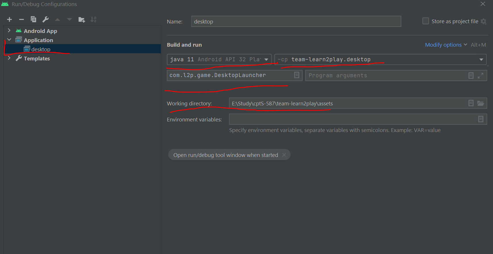
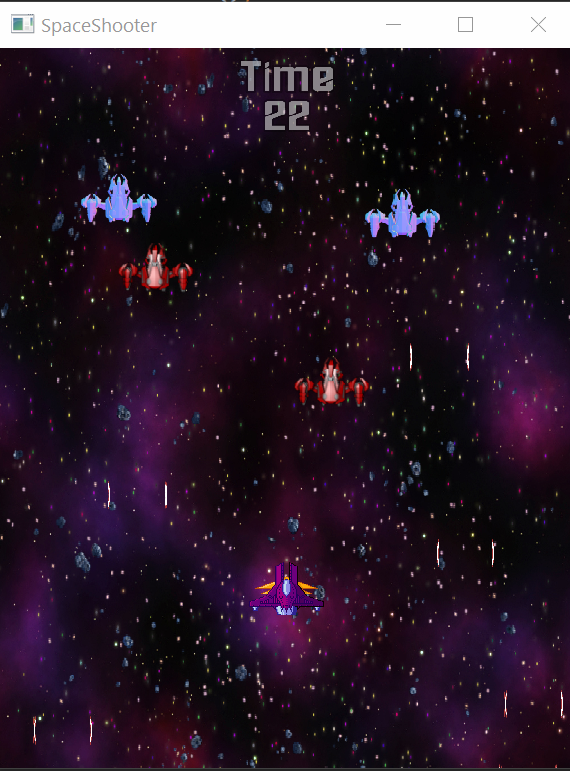
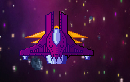
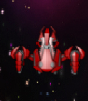
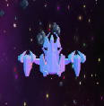
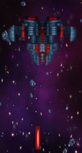
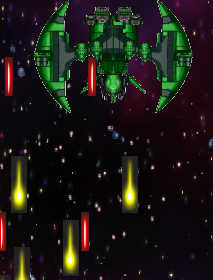

**#Team Learn2Play**

**#Project Members**

-Ahsun Tariq (Team Liason)

-Parikshit Panwar

-Madhumitha Sivakumaran

-Guang-Zheng Lee

**#Introduction**

In the past decade, video games have grown by leaps and bound. Gaming has become a global phenomenon due to the increasing availability and popularity of video games, a shift in demographics has made gaming an all-inclusive pastime that crosses cultural, demographic, and gender lines and technology itself has advanced considerably, resulting in some of the most sophisticated game development ever.There are many genres of game and action being one of them.Shooters are subgenre of action games where the entire focuses is in destruction of enemies using the weapon that the player has. These games test the spatial awareness, reflexes, and speed in both isolated single player or networked multiplayer environments.We have planned to create one such game using the Libgdx,a game development framework in JAVA,where the player encounters several level to defeat a wide range of enemies,starting with regular ones to the final boss,whose defeat will end the game with player's victory.Having started with the initial requirements of creating the characters and enabling them to move, we have also laid out the entire proposed plan on developing the end product.

Instructions to run: Install JAVA and Android studio. Clone the repo and open it using Android studio. Sync gradle files. Create a run configuration for desktop (Select JAVA 11 Android API 32 Platform). Set the classpath module as team-Learn2Play.desktop. Set the main class as com.L2P.DesktopLauncher. Set the working directory to assets. Done! 

**#Current Features**

-Player Character: A purple ship with following abilities:

    -Move in 8 directions using ARROW KEYS within bounds of world.

    -Fire projectiles using SPACE BAR.

    -Toggle slow mode using CAPS LOCK

-**Regular Enemy Type 1:**

    -Red Ship firing yellow projectiles.

    -Lifetime is set to 10s, after that the ship leaves. If a ship leaves, a new ship will be spawned.

**-Regular Enemy Type 2:**

    -Blue ship firing yellow projectiles.

    -Lifetime is set to 10s, after that the ship leaves. If a ship leaves, a new ship will be spawned.

**-Mid Boss:**

    -Large grey sized ship spawning at 24s mark.

    -Fires red projectiles

    -Moves faster and is a little harder to dodge.
**-Final Boss:**

    -Very Large evil looking Green ship spawning 30s.
    
    -Fires large yellow projectiles at much faster rate.

    

**#Project Vision**

The **Space Shooter** game will have the following features:

-**Linear Description of the game:**

The game starts with regular enemies (enemy type 1 and type 2) spawning. The player begins journey of exploring galaxies. At time stamp 0s, the player will start exploring the first galaxy. This galaxy has two types of enemies and two bosses. At time stamp 10s enemy1 and enemy2 will appear. At time stamp 24s mid boss will appear. Finally at time stamp 30s, player shall face the final boss. 

However, we tend to implement different galaxies and each galaxy will have unique regular enemies, mid bosses and final boss.

-**Health features:**

Each Character will have different health points (HP), for example, the health points of bosses will be greater than the regular enemies which will make it difficult to destroy them. The player will have 7 health points at the starting of the game, each regular enemies will 2 health points, mid bosses will have 10 health points and final boss will have 20 health points. The player will be able to refill (upto 7 HP) its health by obtaining health bonuses which will also appear randomly in the game.

-**Firing features:**

Each character in the game is associated with unique firing abilities. Mid bosses and Final boss will have ability to fire their signature shots which will cause greater damage than their regular bullets. However, these signature moves will not be very frequent as compared to their regular shots. Furthermore, mid bosses and final boss will also have the ability to fire regular shots in different patterns. The player will also have the ability to fire signature shots which will cause more damage than regular bullets but only after obtaining firing bonuses which will appear randomly in the game. For the firing power, bullets of regaular enemies will decrease the player HP by 1, mid boss regular bullets will decrease player HP by 2 points and signature shots by 3 points, final boss regular bullets will decrease player HP by 3 points and signature shots by 4 points. 

Midboss and final boss will have more elaborated attacks. For example, when the health drops to 50%, the firing parameters may change, making it more difficult to escape. For example, the time between shots, as well as the bounding box and pattern of the projectile will change, which will provide additional challenge to the player. In the case of final bosss, there may be three stages in which each case firing patterns may be become more frequent increasing the game difficulty level.

-**Variable world parameters:**

For now some parameters are fixed such as the max number of enemies that can be spawned at a given time, lifespan in seconds of enemies, time between shots which is related to the difficulty, enemy movement speed, background images for levels. We intend to make these parameters customizable by reading JSON files, and therefore offering a variation in the gameplay.

-**Platform, Distribution and Architectural constraints:**

One of the advantages of using Libgdx and JAVA is that it supports portability. The same code, with very few changes, can work on multiple platforms such Android, MacOS/PC. However, certain changes maybe required based on the control input (for example, touch input for Android and keyboard for PC). We intend to create the running configuration dynammically based on the platform. In this aspect, we will pursue the feasible software architectural pattern, such as Abstract Factory, to provide the respective user experience.

-**Future work and Research questions:**

Logging user input and events maybe an interesting dimension to explore. This may allow to fine tune the parameters of the game. Many contemporary games use the user data and a generative model to add distinctive elements to the game. We do not plan to implement any Machine Learning method to provide this functionality, nevertheless, logging user data will provide the means to explore this question and thereby provide unique gameplay.
